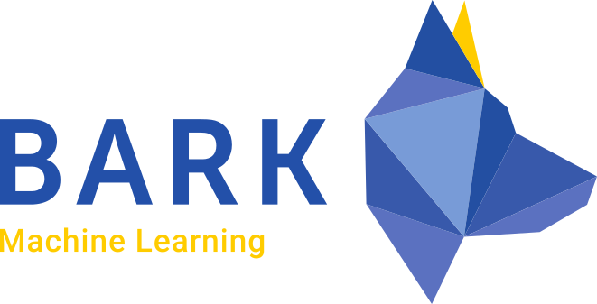
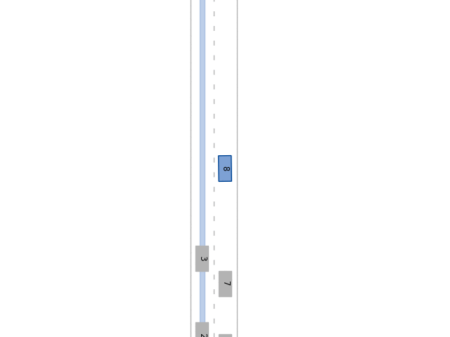
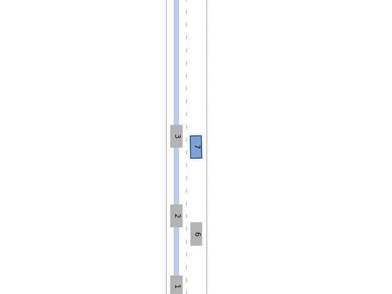

<p align="center">

</p>

# BARK-ML - Machine Learning for Autonomous Driving


BARK-ML provides <i>simple-to-use</i> [OpenAi-Gym](https://github.com/openai/gym) environments for several scenarios, such as highway driving, merging and intersections.
Additionally, BARK-ML integrates <i>state-of-the-art</i> machine learning libraries to learn driving behaviors for autonomous vehicles.

BARK-ML supported machine learning libraries:

* [TF-Agents](https://github.com/tensorflow/agents)
* [Baselines](https://github.com/openai/baselines) (Planned)
* [Diadem](https://github.com/juloberno/diadem)

## Gym Environments

Before running the examples, install the virtual python environment (`bash install.sh`) and enter it (`source dev_into.sh`).

Continuous environments: `bazel run //examples:continuous_env`
<p align="center">

</p>

Available environments:

* `highway-v0`: Continuous highway environment
* `highway-v1`: Discrete highway environment
* `merging-v0`: Continuous merging environment
* `merging-v1`: Discrete merging environment
* `intersection-v0`: Continuous intersection environment
* `intersection-v1`: Discrete intersection environment

## TF-Agents

TF-Agents SAC-example: `bazel run //examples:tfa`.

<p align="center">

</p>

## Running tests

```
bazel test :unit_tests  
bazel test :examples_tests
```

## License

BARK-ML specific code is distributed under MIT License.
